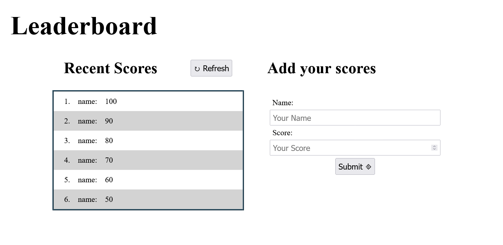

# Leaderboard

> This is a leaderboard showing all the top players, where you can enter your own score, and see how you rank against the other players.
This project is to practice:
> - Using callbacks and promises.
> - Learning how to use proper ES6 syntax.
> - Using ES6 modules to write modular JavaScript.
> - Using webpack to bundle JavaScript.

<!-- Additional description about the project and its features. -->

## Built With

- Html, CSS, Javascript
- Webpack

## Live Demo

[Live Demo Link](https://livedemo.com)

## Getting Started

To get a local copy up and running follow these simple example steps.

### Prerequisites
- Node.js

### Setup
- Clone this repository.

### Install
1. On your computer, open your terminal 
1. `cd` into the repository's folder.
1. Enter `npm install` into the terminal.
1. Enter `npm run build` into the terminal.
1. Run the dist\index.html file.

## Authors

👤 **Humaira Zaman**

- GitHub: [@qwibbler](https://github.com/qwibbler)
- Twitter: [@hmemaz](https://twitter.com/hmemaz)
- LinkedIn: [Humaira Zaman](https://www.linkedin.com/in/hmemaz1994/)

## 🤝 Contributing

Contributions, issues, and feature requests are welcome!

Feel free to check the [issues page](../../issues/).

## Show your support

Give a ⭐️ if you like this project!

## Acknowledgments

- Microverse team.

## 📝 License

This project is [MIT](./MIT.md) licensed.
